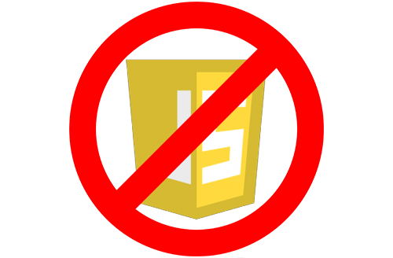

# Blazor - Pourquoi?

## Blazor - Pourquoi?

:::: columns
::: column


:::: columns
::: column
{width="100%"} \
{width="100%"} \
:::
::: column
{width="75%"} \
{width="75%"} \
:::
::::

:::
::: column

 -  Permet d'écrire votre code en *C#* plutôt que *Javascript*.

    On peut donc partager du code entre le frontend et le backend.

 -  Functionne super bien en linux!

    Gracieuseté de *.NET core*.

 -  Très simple à mettre en place et rouler:

    ```bash
    $ dotnet new "Blazor Server App"
    $ dotnet restore && dotnet run
    ```

 -  Interopérabilité Javascript.

    Il est donc possible d'utiliser vos libraries javascript préférées si
    désiré.

:::
::::


## Quelques aspect moins intéressants

:::: columns
::: column

 -  Itération un peu longue lorsque comparée à des languages qui ne requiert pas
    de phases de compilation.

     -  Peu être un peu annuyant lorsqu'on travail sur aspect ui.
     -  *Hot reload* des fichier `*.razor` apparament à venir.

:::
::: column

 -  Framework peut être assez opaque / complexe.

     -  Beaucoup de documentation pour setup complexes clé en main.

     -  Par contre, lorsqu'on veut quelque chose de plus simple / épuré,
        on est un peu laissé à nous même. Examples:

         -  Login simple basé sur cockie session.

     -  Il aura fallu à quelques reprises lorsque documentation déficiente:

         -  Chercher dans les examples.
         -  Chercher dans le code.
         -  Heureusement, open source!

:::
::::
